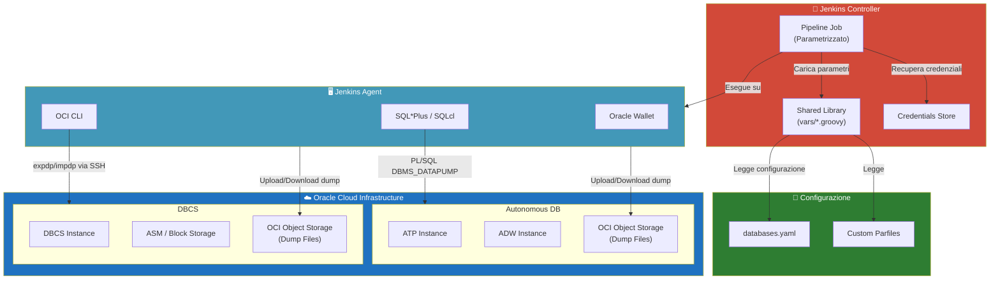
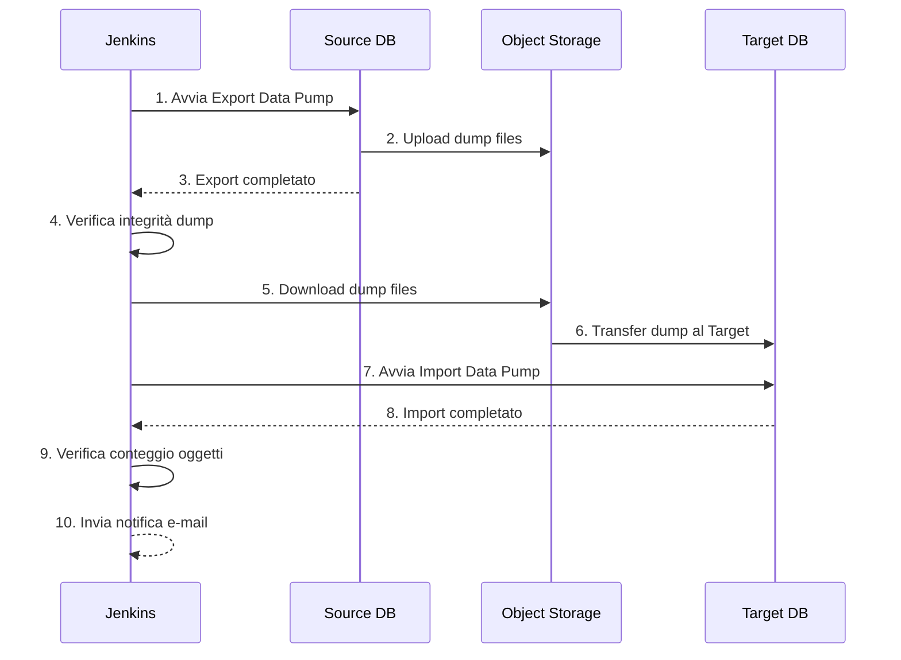
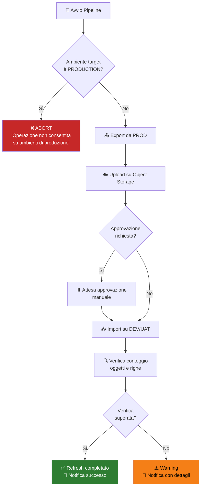
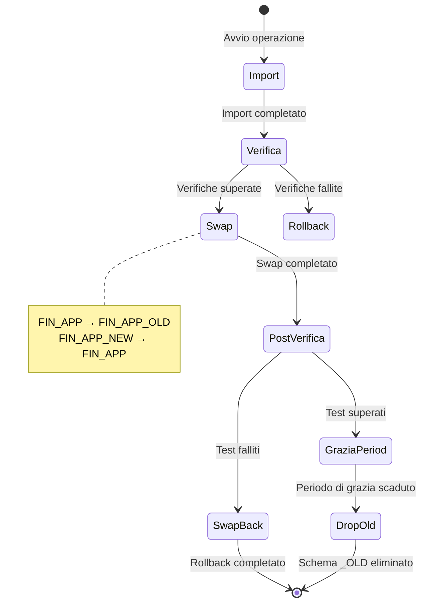
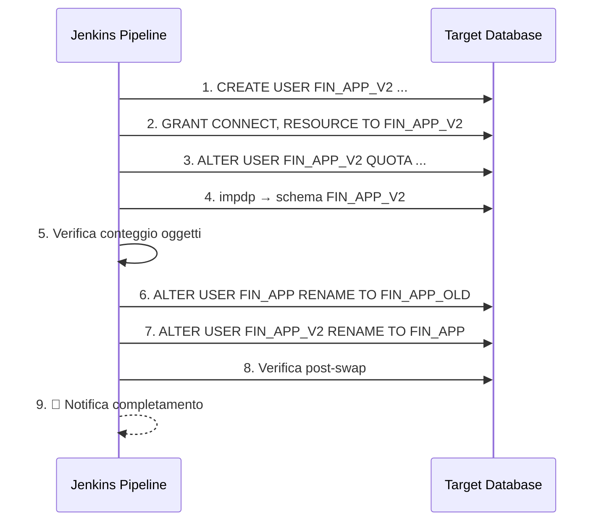
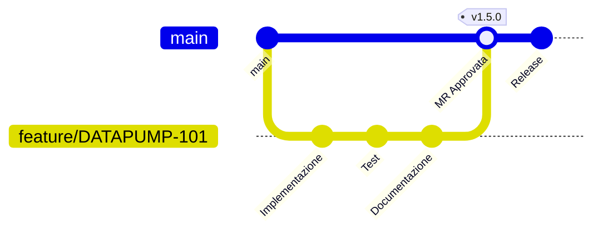

# 🛢️ M-DN Oracle Data Pump Pipeline

> **[UNDER DEV] Pipeline Jenkins di automazione per operazioni Oracle Data Pump su Oracle Cloud Infrastructure (OCI)**


---

## 📋 Indice

0. [🏁 DA DOVE INIZIARE](#-da-dove-iniziare)
1. [Panoramica](#-panoramica)
2. [Prerequisiti](#-prerequisiti)
3. [Installazione e Setup](#-installazione-e-setup)
4. [Guida agli Scenari d'Uso](#-guida-agli-scenari-duso)
5. [Matrice Operazioni × Tipo Database](#-matrice-operazioni--tipo-database)
6. [Configurazione Avanzata](#-configurazione-avanzata)
7. [Sicurezza](#-sicurezza)
8. [Troubleshooting](#-troubleshooting)
9. [Struttura del Progetto](#-struttura-del-progetto)
10. [Contributing](#-contributing)

---

## 🏁 Da Dove Iniziare

> [!IMPORTANT]
> **Sei nuovo nel progetto?**  
> Prima di immergerti nei dettagli tecnici, fermati e leggi il file **[START_HERE.md](file:///c:/DBA/m-dn-oracle-datapump-pipeline/START_HERE.md)**. 
> Contiene la mappa dell'intero repository e l'ordine corretto in cui leggere la documentazione.

---

## 🔭 Panoramica

**M-DN Oracle Data Pump Pipeline** è uno strumento di automazione enterprise-grade progettato per gestire
operazioni Oracle Data Pump (Export/Import) su database Oracle ospitati in **Oracle Cloud Infrastructure (OCI)**.

La pipeline supporta sia database **Autonomous** (ATP/ADW) sia database **DBCS** (DB Cloud Service),
offrendo un'interfaccia parametrizzata unificata tramite Jenkins per tutte le operazioni di
migrazione, backup e refresh degli ambienti.

### Funzionalità principali

- 📤 **Export** di schema, tabelle o database completi
- 📥 **Import** con remap di schema e tablespace
- 🔄 **Refresh ambienti** (PROD → DEV/UAT) con safety checks
- 🔁 **Swap and Drop** per aggiornamenti zero-downtime
- ⏰ **Backup schedulati** tramite cron Jenkins
- 🆕 **Creazione nuovo schema** con import e swap automatizzati
- 🔐 **Gestione credenziali** sicura tramite Jenkins Credentials Store
- 📊 **Notifiche multi-canale** (E-mail, Slack, **Microsoft Teams**) con report dettagliato a fine esecuzione
- 📈 **Ottimizzazione automatica** (Gather Statistics) post-import

### Architettura



### Operazioni supportate

| Operazione | Descrizione |
|---|---|
| `EXPORT` | Export Data Pump di schema, tabelle o full database |
| `IMPORT` | Import Data Pump con remap opzionali |
| `EXPORT_IMPORT` | Export + Import sequenziale (migrazione completa) |
| `SWAP_AFTER_IMPORT` | Import → Verifica → Swap schema → Drop vecchio |
| `CREATE_NEW_SCHEMA` | Crea nuovo schema target, poi esegue import |
| `BACKUP` | Export con naming convention timestamp per retention |
| `HEALTH_CHECK` | Verifica connettività e stato del database |

---

## 🧩 Prerequisiti

### Jenkins

| Componente | Versione minima | Note |
|---|---|---|
| Jenkins | 2.426+ | LTS consigliata |
| Java | JDK 17+ | Temurin o Oracle JDK |

### Plugin Jenkins richiesti

| Plugin | ID | Scopo |
|---|---|---|
| Pipeline | `workflow-aggregator` | Supporto Declarative Pipeline |
| Pipeline Utility Steps | `pipeline-utility-steps` | Parsing YAML, file utilities |
| Credentials Binding | `credentials-binding` | Iniezione sicura credenziali |
| Email Extension | `email-ext` | Notifiche e-mail avanzate |
| AnsiColor | `ansicolor` | Output colorato nel log |
| Timestamper | `timestamper` | Timestamp su ogni riga di log |
| Blue Ocean | `blueocean` | UI moderna (opzionale ma consigliato) |

> **Installazione plugin via CLI:**
> ```bash
> jenkins-cli install-plugin workflow-aggregator pipeline-utility-steps \
>   credentials-binding email-ext ansicolor timestamper blueocean
> ```

### Oracle Client

- **Oracle Instant Client 19c+** oppure **SQL\*Plus/SQLcl** installato sul Jenkins Agent
- `ORACLE_HOME` e `LD_LIBRARY_PATH` (Linux) o `PATH` (Windows) configurati correttamente
- Per Autonomous DB: **Oracle Wallet** scaricato e configurato in `TNS_ADMIN`

### OCI CLI

- **OCI CLI** installato e configurato (`~/.oci/config`) sul Jenkins Agent
- Profilo con permessi di lettura/scrittura su:
  - Object Storage (bucket per dump files)
  - Database Service (per DBCS)
  - Autonomous Database (per ATP/ADW)

### Credenziali Jenkins da configurare

| Credential ID | Tipo | Descrizione |
|---|---|---|
| `oracle-sys-password` | Secret text | Password utente SYS |
| `oracle-admin-password` | Secret text | Password utente ADMIN (Autonomous DB) |
| `oracle-schema-password` | Secret text | Password schema applicativo |
| `oci-api-key` | Secret file | Chiave API privata OCI (PEM) |
| `oci-tenancy-ocid` | Secret text | OCID del tenancy OCI |
| `oci-user-ocid` | Secret text | OCID dell'utente OCI |
| `oci-fingerprint` | Secret text | Fingerprint della chiave API |
| `oracle-wallet-zip` | Secret file | Wallet ZIP per Autonomous DB |
| `email-smtp-credentials` | Username/Password | Credenziali server SMTP |
| `m-dn-teams-webhook` | Secret text | Webhook URL per canale Microsoft Teams |

---

## 🚀 Installazione e Setup

### Passo 1 — Clonare il repository

```bash
git clone https://git.m-dn.com/dba-team/m-dn-oracle-datapump-pipeline.git
cd m-dn-oracle-datapump-pipeline
```

### Passo 2 — Configurare la Shared Library in Jenkins

1. Navigare in **Manage Jenkins → System → Global Pipeline Libraries**
2. Aggiungere una nuova library:

| Campo | Valore |
|---|---|
| Name | `m-dn-datapump-lib` |
| Default version | `main` |
| Retrieval method | Modern SCM → Git |
| Project Repository | `https://git.m-dn.com/dba-team/m-dn-oracle-datapump-pipeline.git` |
| Credentials | Credenziali Git appropriate |
| Load implicitly | ✅ |

<!-- 📸 Screenshot: Jenkins Shared Library Configuration -->

### Passo 3 — Configurare le credenziali Jenkins

1. Navigare in **Manage Jenkins → Credentials → System → Global credentials**
2. Per ogni credenziale nella tabella sopra, cliccare **Add Credentials**
3. Selezionare il tipo appropriato (Secret text, Secret file, Username/Password)
4. Inserire l'**ID** esattamente come indicato nella tabella

<!-- 📸 Screenshot: Jenkins Credentials Configuration -->

> [!IMPORTANT]
> Gli ID delle credenziali devono corrispondere esattamente a quelli definiti nel `Jenkinsfile`.
> Una discrepanza causerà errori `CredentialNotFoundException` in fase di esecuzione.

### Passo 4 — Configurare `databases.yaml`

Creare o modificare il file `config/databases.yaml` con i database target:

```yaml
# config/databases.yaml
# Configurazione database M-DN per Data Pump Pipeline

databases:
  # --- Autonomous Database (ATP) ---
  atp-prod-finance:
    type: autonomous
    environment: production
    display_name: "ATP Produzione - Finance"
    ocid: "ocid1.autonomousdatabase.oc1.eu-milan-1.xxxxxxxxxxxxxxxx"
    compartment_ocid: "ocid1.compartment.oc1..xxxxxxxxxxxxxxxx"
    region: eu-milan-1
    service_name: "finprod_tp"
    wallet_credential_id: "oracle-wallet-zip"
    admin_credential_id: "oracle-admin-password"
    object_storage:
      namespace: "enicloud"
      bucket: "datapump-finance-prod"
      region: eu-milan-1

  atp-dev-finance:
    type: autonomous
    environment: development
    display_name: "ATP Sviluppo - Finance"
    ocid: "ocid1.autonomousdatabase.oc1.eu-milan-1.yyyyyyyyyyyyyyyy"
    compartment_ocid: "ocid1.compartment.oc1..yyyyyyyyyyyyyyyy"
    region: eu-milan-1
    service_name: "findev_tp"
    wallet_credential_id: "oracle-wallet-zip"
    admin_credential_id: "oracle-admin-password"
    object_storage:
      namespace: "enicloud"
      bucket: "datapump-finance-dev"
      region: eu-milan-1

  # --- DBCS ---
  dbcs-prod-hr:
    type: dbcs
    environment: production
    display_name: "DBCS Produzione - HR"
    host: "dbcs-prod-hr.sub12345.vcn1.oraclevcn.com"
    port: 1521
    service_name: "hrprod.sub12345.vcn1.oraclevcn.com"
    ssh_credential_id: "dbcs-ssh-key"
    sys_credential_id: "oracle-sys-password"
    data_pump_dir: "DATA_PUMP_DIR"
    object_storage:
      namespace: "enicloud"
      bucket: "datapump-hr-prod"
      region: eu-milan-1
```

### Passo 5 — Creare il Pipeline Job in Jenkins

1. In Jenkins, cliccare **New Item → Pipeline**
2. Nome del job: `M-DN-DataPump-Pipeline`
3. Nella sezione **Pipeline**:
   - Definition: **Pipeline script from SCM**
   - SCM: Git
   - Repository URL: URL del repository
   - Script Path: `Jenkinsfile`
4. Salvare

<!-- 📸 Screenshot: Jenkins Pipeline Job Configuration -->

### Passo 6 — Eseguire l'Health Check

Prima build: selezionare l'operazione `HEALTH_CHECK` per verificare la connettività:

```
Operazione: HEALTH_CHECK
Database Sorgente: atp-prod-finance
```

Se il check ha successo, l'ambiente è pronto per le operazioni Data Pump.

---

## 📖 Guida agli Scenari d'Uso

### Scenario 1 — Export Schema

**Quando usarlo:** Backup di uno o più schema prima di un rilascio applicativo, migrazione,
o per archiviazione periodica.

**Parametri richiesti:**

| Parametro | Valore esempio |
|---|---|
| `OPERATION` | `EXPORT` |
| `SOURCE_DB` | `atp-prod-finance` |
| `SCHEMAS` | `FIN_APP,FIN_STAGING` |
| `PARALLEL` | `4` |
| `COMPRESSION` | `ALL` |

**Esempio di esecuzione:**

```groovy
// Il pipeline genera automaticamente il comando equivalente a:
expdp ADMIN/****@finprod_tp \
  schemas=FIN_APP,FIN_STAGING \
  directory=DATA_PUMP_DIR \
  dumpfile=export_FIN_APP_20260712_155000_%U.dmp \
  logfile=export_FIN_APP_20260712_155000.log \
  parallel=4 \
  compression=ALL \
  filesize=5G
```

**Risultato atteso:**
- File dump caricati su OCI Object Storage nel bucket configurato
- Log di export disponibile negli artifacts Jenkins
- E-mail di notifica inviata al team DBA

---

### Scenario 2 — Import Schema con Remap

**Quando usarlo:** Importare dati in uno schema diverso da quello di origine,
tipicamente per refresh ambienti DEV/UAT da produzione.

**Parametri richiesti:**

| Parametro | Valore esempio |
|---|---|
| `OPERATION` | `IMPORT` |
| `TARGET_DB` | `atp-dev-finance` |
| `DUMP_FILE` | `export_FIN_APP_20260712_155000.dmp` |
| `REMAP_SCHEMA` | `FIN_APP:FIN_APP_DEV` |
| `REMAP_TABLESPACE` | `DATA:DATA_DEV` |
| `TABLE_EXISTS_ACTION` | `REPLACE` |

**Esempio di esecuzione:**

```groovy
// Comando equivalente generato:
impdp ADMIN/****@findev_tp \
  schemas=FIN_APP \
  remap_schema=FIN_APP:FIN_APP_DEV \
  remap_tablespace=DATA:DATA_DEV \
  directory=DATA_PUMP_DIR \
  dumpfile=export_FIN_APP_20260712_155000.dmp \
  logfile=import_FIN_APP_DEV_20260712_160000.log \
  table_exists_action=REPLACE
```

> [!TIP]
> È possibile specificare più remap separandoli con virgola:
> `FIN_APP:FIN_APP_DEV,FIN_STAGING:FIN_STAGING_DEV`

---

### Scenario 3 — Export e Import Completo (Migrazione)

**Quando usarlo:** Migrazione completa di schema da un database all'altro,
ad esempio da on-premise a OCI o tra ambienti OCI.

**Parametri richiesti:**

| Parametro | Valore esempio |
|---|---|
| `OPERATION` | `EXPORT_IMPORT` |
| `SOURCE_DB` | `dbcs-prod-hr` |
| `TARGET_DB` | `atp-dev-finance` |
| `SCHEMAS` | `HR_APP` |
| `REMAP_SCHEMA` | `HR_APP:HR_APP_DEV` |
| `REMAP_TABLESPACE` | `USERS:DATA_DEV` |
| `TABLE_EXISTS_ACTION` | `REPLACE` |
| `PARALLEL` | `4` |

**Flusso di esecuzione:**



---

### Scenario 4 — Backup Schedulato

**Quando usarlo:** Backup automatico notturno o settimanale degli schema critici.

**Configurazione cron in Jenkins:**

1. Nel job Pipeline, sezione **Build Triggers**
2. Selezionare **Build periodically**
3. Inserire l'espressione cron:

```
# Ogni notte alle 02:00 (fuso orario del server Jenkins)
H 2 * * *

# Ogni domenica alle 03:00
H 3 * * 0

# Ogni giorno lavorativo alle 23:00
H 23 * * 1-5
```

**Parametri predefiniti per backup schedulato:**

```groovy
// Nel Jenkinsfile, configurare i default per backup:
parameters {
    string(name: 'OPERATION', defaultValue: 'BACKUP')
    string(name: 'SOURCE_DB', defaultValue: 'atp-prod-finance')
    string(name: 'SCHEMAS', defaultValue: 'FIN_APP,FIN_STAGING,FIN_REPORTING')
    string(name: 'PARALLEL', defaultValue: '4')
    string(name: 'COMPRESSION', defaultValue: 'ALL')
    string(name: 'RETENTION_DAYS', defaultValue: '30')
}
```

> [!NOTE]
> Il parametro `RETENTION_DAYS` configura la pulizia automatica dei dump file più vecchi
> dal bucket Object Storage. Il default è 30 giorni.

---

### Scenario 5 — Refresh Ambiente (PROD → DEV/UAT)

**Quando usarlo:** Aggiornare l'ambiente di sviluppo o UAT con dati recenti di produzione.

**⚠️ Misure di sicurezza integrate:**

- Verifica che il target **NON** sia un ambiente di produzione
- Richiesta di conferma interattiva (se `REQUIRE_APPROVAL=true`)
- Mascheramento automatico dei dati sensibili (se configurato)
- Log completo di tutte le operazioni per audit

**Flusso passo-passo:**



**Parametri:**

| Parametro | Valore |
|---|---|
| `OPERATION` | `EXPORT_IMPORT` |
| `SOURCE_DB` | `atp-prod-finance` |
| `TARGET_DB` | `atp-dev-finance` |
| `SCHEMAS` | `FIN_APP` |
| `REMAP_SCHEMA` | `FIN_APP:FIN_APP_DEV` |
| `TABLE_EXISTS_ACTION` | `REPLACE` |
| `REQUIRE_APPROVAL` | `true` |
| `DATA_MASKING` | `true` |

---

### Scenario 6 — Swap and Drop

**Quando usarlo:** Aggiornamento di uno schema con zero-downtime. Ideale per rilasci in produzione
dove è necessario avere una strategia di rollback immediata.

**Pattern completo:**

1. **Import** dei nuovi dati in uno schema temporaneo (`FIN_APP_NEW`)
2. **Verifica** integrità e conteggio oggetti
3. **Swap** — rinomina lo schema corrente in `_OLD` e il nuovo in quello definitivo
4. **Verifica post-swap** — test applicativi
5. **Drop** dello schema `_OLD` (dopo periodo di grazia)



**Parametri:**

| Parametro | Valore |
|---|---|
| `OPERATION` | `SWAP_AFTER_IMPORT` |
| `TARGET_DB` | `atp-prod-finance` |
| `DUMP_FILE` | `export_FIN_APP_20260712.dmp` |
| `SCHEMAS` | `FIN_APP` |
| `TEMP_SCHEMA_SUFFIX` | `_NEW` |
| `OLD_SCHEMA_SUFFIX` | `_OLD` |
| `GRACE_PERIOD_HOURS` | `24` |

> [!CAUTION]
> L'operazione Swap and Drop su ambienti di produzione richiede **approvazione obbligatoria**
> da parte di un membro del team DBA con ruolo `dba-senior`. Assicurarsi che le policy RBAC
> di Jenkins siano configurate correttamente.

---

### Scenario 7 — Export/Import Tabelle Specifiche

**Quando usarlo:** Operazioni su tabelle specifiche anziché su interi schema.
Utile per migrazioni parziali o debug.

**Export di tabelle specifiche:**

| Parametro | Valore |
|---|---|
| `OPERATION` | `EXPORT` |
| `SOURCE_DB` | `atp-prod-finance` |
| `TABLES` | `FIN_APP.TRANSACTIONS,FIN_APP.ACCOUNTS,FIN_APP.LEDGER` |
| `QUERY_FILTER` | `"WHERE CREATION_DATE >= TO_DATE('2026-01-01','YYYY-MM-DD')"` |
| `COMPRESSION` | `ALL` |

**Import di tabelle specifiche:**

| Parametro | Valore |
|---|---|
| `OPERATION` | `IMPORT` |
| `TARGET_DB` | `atp-dev-finance` |
| `DUMP_FILE` | `export_tables_20260712.dmp` |
| `TABLES` | `FIN_APP.TRANSACTIONS,FIN_APP.ACCOUNTS` |
| `TABLE_EXISTS_ACTION` | `TRUNCATE` |
| `REMAP_SCHEMA` | `FIN_APP:FIN_APP_DEV` |

> [!TIP]
> Il parametro `QUERY_FILTER` permette di esportare solo un sottoinsieme dei dati,
> riducendo significativamente il tempo di export e la dimensione del dump file.

---

### Scenario 8 — Import in Nuovo Schema + Swap

**Quando usarlo:** Creare un nuovo schema da zero, importarvi i dati, e poi
swappare con lo schema esistente. Workflow completo per migrazioni con cambio
di struttura.

**Flusso:**



**Parametri:**

| Parametro | Valore |
|---|---|
| `OPERATION` | `CREATE_NEW_SCHEMA` |
| `TARGET_DB` | `atp-prod-finance` |
| `DUMP_FILE` | `export_FIN_APP_20260712.dmp` |
| `SCHEMAS` | `FIN_APP` |
| `NEW_SCHEMA_NAME` | `FIN_APP_V2` |
| `NEW_SCHEMA_PASSWORD` | (da credenziale Jenkins) |
| `DEFAULT_TABLESPACE` | `DATA` |
| `TEMP_TABLESPACE` | `TEMP` |
| `QUOTA` | `UNLIMITED` |
| `SWAP_AFTER_IMPORT` | `true` |

---

## 📊 Matrice Operazioni × Tipo Database

La seguente tabella mostra la compatibilità di ogni operazione con i tipi di database supportati:

| Operazione | Autonomous DB (ATP/ADW) | DBCS | Note |
|---|:---:|:---:|---|
| `EXPORT` | ✅ | ✅ | ADB: via PL/SQL `DBMS_DATAPUMP` / DBCS: via `expdp` CLI |
| `IMPORT` | ✅ | ✅ | ADB: via PL/SQL `DBMS_DATAPUMP` / DBCS: via `impdp` CLI |
| `EXPORT_IMPORT` | ✅ | ✅ | Cross-type supportato (es. DBCS→ADB) |
| `SWAP_AFTER_IMPORT` | ✅ | ✅ | Richiede privilegi `ALTER USER` |
| `CREATE_NEW_SCHEMA` | ✅ | ✅ | ADB: via `ADMIN` / DBCS: via `SYS` |
| `BACKUP` | ✅ | ✅ | Identico a `EXPORT` con naming timestamp |
| `HEALTH_CHECK` | ✅ | ✅ | Verifica connettività e stato |
| Custom Parfile | ⚠️ Parziale | ✅ | ADB non supporta tutti i parametri `expdp/impdp` |
| `PARALLEL > 1` | ✅ (max ECPU) | ✅ | ADB limitato dal numero di ECPU allocati |
| `COMPRESSION` | ✅ | ✅ (richiede ACE) | DBCS: richiede licenza Advanced Compression |
| `ENCRYPTION` | ✅ (nativo TDE) | ✅ | ADB: encryption sempre attiva (TDE) |
| Accesso via SSH | ❌ | ✅ | ADB non supporta accesso SSH diretto |
| Object Storage diretto | ✅ (DBMS_CLOUD) | ✅ (OCI CLI) | Metodi diversi per tipo |

> [!NOTE]
> Per operazioni **cross-type** (es. export da DBCS, import su ADB), il pipeline gestisce
> automaticamente la conversione del formato di trasferimento tramite Object Storage come
> layer intermedio.

---

## ⚙️ Configurazione Avanzata

### Custom Parfiles

Per operazioni con parametri avanzati, è possibile creare file di parametri personalizzati
nella directory `config/parfiles/`:

```bash
# config/parfiles/export_fin_app_custom.par

SCHEMAS=FIN_APP
DIRECTORY=DATA_PUMP_DIR
DUMPFILE=export_fin_app_%U.dmp
LOGFILE=export_fin_app.log
PARALLEL=8
COMPRESSION=ALL
FILESIZE=10G
EXCLUDE=TABLE:"IN ('TEMP_LOG','AUDIT_ARCHIVE','SESSION_DATA')"
EXCLUDE=STATISTICS
FLASHBACK_TIME="TO_TIMESTAMP('2026-07-12 02:00:00','YYYY-MM-DD HH24:MI:SS')"
METRICS=YES
LOGTIME=ALL
```

Per utilizzare un parfile personalizzato, specificare il parametro `PARFILE`:

| Parametro | Valore |
|---|---|
| `PARFILE` | `config/parfiles/export_fin_app_custom.par` |

### Tuning del Parallelismo

Il parametro `PARALLEL` controlla il numero di worker Data Pump. Linee guida:

| Dimensione dati | PARALLEL consigliato | Note |
|---|---|---|
| < 10 GB | 1-2 | Overhead minimo |
| 10-100 GB | 4-8 | Bilanciamento ottimale |
| 100-500 GB | 8-16 | Richiede I/O adeguato |
| > 500 GB | 16-32 | Solo DBCS con storage performante |

> [!WARNING]
> Su Autonomous DB, il valore `PARALLEL` è limitato dal numero di ECPU disponibili.
> Un valore troppo alto può causare throttling e rallentamenti.

### Opzioni di Compressione

```yaml
# Valori supportati per COMPRESSION:
compression_options:
  - ALL          # Comprimi tutto (metadati + dati)
  - DATA_ONLY    # Comprimi solo i dati
  - METADATA_ONLY # Comprimi solo i metadati
  - NONE         # Nessuna compressione
```

**Rapporto di compressione tipico:** 3:1 — 10:1 a seconda del tipo di dati.

### Encryption

```yaml
# Configurazione encryption nel parametro ENCRYPTION:
encryption_options:
  - ALL            # Cifra tutto
  - DATA_ONLY      # Cifra solo i dati
  - ENCRYPTED_COLUMNS_ONLY  # Solo colonne già cifrate
  - METADATA_ONLY  # Cifra solo i metadati
  - NONE           # Nessuna cifratura

# Algoritmi disponibili (ENCRYPTION_ALGORITHM):
  - AES128
  - AES192
  - AES256         # Consigliato per M-DN
```

### Query Filters

Filtrare i dati esportati con clausole WHERE:

```
QUERY_FILTER="WHERE CREATION_DATE >= SYSDATE - 365"
```

Per filtri su tabelle specifiche:

```
QUERY_FILTER="FIN_APP.TRANSACTIONS:WHERE AMOUNT > 1000,FIN_APP.ACCOUNTS:WHERE STATUS='ACTIVE'"
```

### Esclusione Tabelle

Escludere tabelle specifiche dall'export:

```
EXCLUDE_TABLES="TEMP_LOG,AUDIT_ARCHIVE,SESSION_DATA,DEBUG_TRACE"
```

Escludere per pattern:

```
EXCLUDE_OBJECTS="TABLE:\"LIKE 'TMP_%'\",TABLE:\"LIKE 'BKP_%'\""
```

---

## 🔐 Sicurezza

### Gestione Credenziali

Tutte le credenziali sono gestite esclusivamente tramite **Jenkins Credentials Store**.
Nessuna password, chiave API o token è mai memorizzata:

- ❌ Nel codice sorgente
- ❌ Nei file di configurazione
- ❌ Nei log di esecuzione
- ❌ Nelle variabili d'ambiente in chiaro

```groovy
// Esempio: utilizzo sicuro delle credenziali nel pipeline
pipeline {
    stages {
        stage('Export') {
            steps {
                withCredentials([
                    string(credentialsId: 'oracle-admin-password', variable: 'ADMIN_PWD'),
                    file(credentialsId: 'oracle-wallet-zip', variable: 'WALLET_PATH'),
                    string(credentialsId: 'oci-api-key', variable: 'OCI_KEY')
                ]) {
                    // Le credenziali sono disponibili SOLO in questo blocco
                    // e mascherate automaticamente nei log Jenkins
                    sh """
                        export TNS_ADMIN=\${WALLET_PATH}
                        sqlplus -s ADMIN/\${ADMIN_PWD}@finprod_tp @scripts/export.sql
                    """
                }
            }
        }
    }
}
```

### RBAC — Role-Based Access Control

Si consiglia la seguente configurazione RBAC tramite il plugin **Role Strategy**:

| Ruolo | Permessi | Descrizione |
|---|---|---|
| `dba-senior` | Build, Configure, Cancel, Approve | DBA senior — accesso completo |
| `dba-junior` | Build (solo DEV/UAT), View | DBA junior — solo ambienti non-prod |
| `dev-team` | View, Build (solo HEALTH_CHECK) | Sviluppatori — solo visualizzazione e check |
| `auditor` | View (solo log) | Auditor — accesso in sola lettura ai log |

**Configurazione consigliata in Jenkins:**

```groovy
// Nel Jenkinsfile: protezione ambienti di produzione
stage('Safety Check') {
    when {
        expression {
            return params.TARGET_DB?.contains('prod')
        }
    }
    steps {
        // Solo utenti con ruolo dba-senior possono approvare
        input message: 'Operazione su ambiente di PRODUZIONE. Confermare?',
              submitter: 'dba-senior',
              submitterParameter: 'approver'

        echo "Operazione approvata da: ${approver}"
    }
}
```

### Audit Logging

Ogni esecuzione del pipeline genera un record di audit con:

- 📅 **Timestamp** di inizio e fine operazione
- 👤 **Utente** che ha avviato il build
- 🗄️ **Database** sorgente e/o target
- 📋 **Operazione** eseguita e parametri utilizzati
- ✅/❌ **Esito** dell'operazione
- 📝 **Log completo** archiviato come artifact Jenkins
- 📧 **Notifica e-mail** inviata al team DBA

I log sono conservati secondo la policy di retention del job Jenkins (default: 30 build).

### Protezioni per Ambienti di Produzione

| Protezione | Descrizione | Default |
|---|---|---|
| Conferma interattiva | `input` step prima di operazioni su PROD | ✅ Attivo |
| Blocco `DROP` su PROD | Impedisce `TABLE_EXISTS_ACTION=DROP` su produzione | ✅ Attivo |
| Orario di manutenzione | Operazioni PROD solo in finestra di manutenzione | ⚠️ Configurabile |
| Dry-run | Esecuzione simulata senza modifiche | ⚠️ Configurabile |
| Double-check OCID | Verifica OCID del database prima dell'operazione | ✅ Attivo |

---

## 🔧 Troubleshooting

### Errori comuni e soluzioni

#### ORA-39001: invalid argument

**Causa:** Parametro non valido passato a `DBMS_DATAPUMP` o `expdp/impdp`.

**Soluzioni:**
1. Verificare che il nome della directory Data Pump sia corretto:
   ```sql
   SELECT * FROM dba_directories WHERE directory_name = 'DATA_PUMP_DIR';
   ```
2. Controllare che l'utente abbia privilegi `READ` e `WRITE` sulla directory
3. Per Autonomous DB, usare solo la directory `DATA_PUMP_DIR` predefinita

---

#### ORA-31693: Table data object failed to load/unload

**Causa:** Errore durante il caricamento dei dati di una tabella.

**Soluzioni:**
1. Verificare spazio disponibile nel tablespace target:
   ```sql
   SELECT tablespace_name, 
          ROUND(SUM(bytes)/1024/1024/1024, 2) AS used_gb,
          ROUND(SUM(maxbytes)/1024/1024/1024, 2) AS max_gb
   FROM dba_data_files
   GROUP BY tablespace_name;
   ```
2. Se il problema è una tabella specifica, usare `EXCLUDE_TABLES` per saltarla
3. Verificare vincoli di integrità referenziale nel target

---

#### Errori di autenticazione OCI

**Causa:** Configurazione OCI CLI non corretta o credenziali scadute.

**Soluzioni:**
1. Verificare la configurazione OCI CLI:
   ```bash
   oci iam user get --user-id <USER_OCID>
   ```
2. Controllare che il fingerprint corrisponda alla chiave API:
   ```bash
   openssl rsa -pubout -outform DER -in ~/.oci/oci_api_key.pem | \
     openssl md5 -c
   ```
3. Verificare che la chiave API non sia scaduta nel tenant OCI
4. In Jenkins, aggiornare la credenziale `oci-api-key` con la nuova chiave PEM

---

#### Problemi con Oracle Wallet

**Causa:** Wallet non configurato correttamente o scaduto.

**Soluzioni:**
1. Verificare che il wallet sia estratto correttamente:
   ```bash
   ls -la $TNS_ADMIN/
   # Deve contenere: cwallet.sso, ewallet.p12, tnsnames.ora, sqlnet.ora
   ```
2. Testare la connessione con il wallet:
   ```bash
   sqlplus ADMIN@finprod_tp
   ```
3. Se il wallet è scaduto, scaricarne uno nuovo dalla console OCI:
   - OCI Console → Autonomous Database → DB Details → DB Connection → Download Wallet
4. Aggiornare la credenziale `oracle-wallet-zip` in Jenkins

---

#### Tablespace pieno (ORA-01653 / ORA-01688)

**Causa:** Lo spazio nel tablespace target è esaurito durante l'import.

**Soluzioni:**
1. Per Autonomous DB, aumentare lo storage:
   ```bash
   oci db autonomous-database update \
     --autonomous-database-id <OCID> \
     --data-storage-size-in-tbs 2
   ```
2. Per DBCS, aggiungere un datafile:
   ```sql
   ALTER TABLESPACE DATA ADD DATAFILE '+DATA' SIZE 10G AUTOEXTEND ON MAXSIZE 50G;
   ```
3. Verificare lo spazio disponibile prima dell'import (il pipeline lo fa automaticamente)

---

#### Network timeout durante il trasferimento

**Causa:** Timeout di rete durante upload/download dei dump file su Object Storage.

**Soluzioni:**
1. Verificare la connettività di rete verso OCI:
   ```bash
   curl -I https://objectstorage.eu-milan-1.oraclecloud.com
   ```
2. Aumentare il timeout nel pipeline:
   ```yaml
   # In databases.yaml
   network:
     connect_timeout: 300
     read_timeout: 600
     retry_count: 3
   ```
3. Per file molto grandi, considerare il trasferimento multipart
4. Verificare le security list e NSG nella VCN OCI

---

#### Data Pump job bloccato (STUCK)

**Causa:** Un job Data Pump precedente è rimasto in stato `EXECUTING` o `NOT RUNNING`.

**Soluzioni:**
1. Identificare i job Data Pump attivi:
   ```sql
   SELECT owner_name, job_name, operation, job_mode, state,
          attached_sessions
   FROM dba_datapump_jobs
   WHERE state != 'NOT RUNNING' OR attached_sessions > 0;
   ```
2. Fermare e cancellare il job bloccato:
   ```sql
   -- Attach al job
   DECLARE
     h NUMBER;
   BEGIN
     h := DBMS_DATAPUMP.ATTACH(job_name => 'SYS_EXPORT_SCHEMA_01',
                                job_owner => 'ADMIN');
     DBMS_DATAPUMP.STOP_JOB(handle => h, immediate => 1);
   END;
   /
   ```
3. Se il job non risponde:
   ```sql
   -- Eliminazione forzata (usare con cautela)
   BEGIN
     DBMS_DATAPUMP.DETACH('SYS_EXPORT_SCHEMA_01');
   END;
   /

   -- Cancellare la master table
   DROP TABLE ADMIN.SYS_EXPORT_SCHEMA_01;
   ```

> [!WARNING]
> L'eliminazione forzata di un job Data Pump può lasciare file temporanei sul filesystem.
> Verificare e rimuovere manualmente i file `.dmp` parziali dalla directory Data Pump.

---

## 📁 Struttura del Progetto

```
m-dn-oracle-datapump-pipeline/
├── 📄 Jenkinsfile                          # Pipeline principale (Declarative)
├── 📄 README.md                            # Questa documentazione
├── 📁 vars/                                # Shared Library - Global Variables
│   ├── 📄 datapumpExport.groovy            # Step: export Data Pump
│   ├── 📄 datapumpImport.groovy            # Step: import Data Pump
│   ├── 📄 datapumpSwap.groovy              # Step: swap schema
│   ├── 📄 datapumpCreateSchema.groovy      # Step: creazione nuovo schema
│   ├── 📄 datapumpHealthCheck.groovy       # Step: health check
│   ├── 📄 datapumpValidation.groovy        # Step: validazione parametri
│   ├── 📄 ociObjectStorage.groovy          # Utility: upload/download da OCI OSS
│   ├── 📄 oracleConnection.groovy          # Utility: connessione Oracle
│   ├── 📄 sendNotification.groovy          # Utility: invio notifiche e-mail
│   └── 📄 loadDatabaseConfig.groovy        # Utility: parsing databases.yaml
├── 📁 src/                                 # Shared Library - Classi Groovy
│   └── 📁 com/m-dn/dba/
│       ├── 📄 DataPumpOperation.groovy     # Enum operazioni
│       ├── 📄 DatabaseConfig.groovy        # POJO configurazione DB
│       ├── 📄 ValidationResult.groovy      # Risultato validazione
│       └── 📄 AuditLogger.groovy           # Logger per audit trail
├── 📁 config/                              # File di configurazione
│   ├── 📄 databases.yaml                   # Definizione database target
│   ├── 📄 notification-templates.yaml      # Template e-mail
│   └── 📁 parfiles/                        # Parfile personalizzati
│       ├── 📄 export_full.par              # Template export completo
│       ├── 📄 export_incremental.par       # Template export incrementale
│       └── 📄 import_with_remap.par        # Template import con remap
├── 📁 scripts/                             # Script SQL e shell
│   ├── 📁 sql/
│   │   ├── 📄 check_datapump_jobs.sql      # Verifica job DP attivi
│   │   ├── 📄 create_schema.sql            # Creazione nuovo schema
│   │   ├── 📄 count_objects.sql            # Conteggio oggetti schema
│   │   ├── 📄 swap_schemas.sql             # Swap di due schema
│   │   ├── 📄 drop_schema.sql              # Drop schema (con safety check)
│   │   ├── 📄 grant_permissions.sql        # Grant permessi standard
│   │   └── 📄 health_check.sql             # Query di health check
│   └── 📁 shell/
│       ├── 📄 setup_wallet.sh              # Configurazione Oracle Wallet
│       ├── 📄 cleanup_dumps.sh             # Pulizia dump file vecchi
│       └── 📄 validate_environment.sh      # Validazione ambiente
├── 📁 tests/                               # Test della pipeline
│   ├── 📄 Jenkinsfile.test                 # Pipeline di test
│   ├── 📄 test_validation.groovy           # Test validazione parametri
│   └── 📄 test_database_config.groovy      # Test parsing configurazione
└── 📁 docs/                                # Documentazione aggiuntiva
    ├── 📄 CHANGELOG.md                     # Registro delle modifiche
    ├── 📄 ARCHITECTURE.md                  # Documentazione architetturale
    └── 📁 images/                          # Screenshot e diagrammi
        ├── 📄 pipeline-overview.png
        ├── 📄 jenkins-config.png
        └── 📄 blue-ocean-view.png
```

---

## 🤝 Contributing

### Come aggiungere un nuovo database

1. **Modificare `config/databases.yaml`** aggiungendo la nuova voce:

```yaml
databases:
  # Nuovo database
  atp-prod-logistics:
    type: autonomous
    environment: production
    display_name: "ATP Produzione - Logistics"
    ocid: "ocid1.autonomousdatabase.oc1.eu-milan-1.zzzzzzzzzzzzzzzz"
    compartment_ocid: "ocid1.compartment.oc1..zzzzzzzzzzzzzzzz"
    region: eu-milan-1
    service_name: "logprod_tp"
    wallet_credential_id: "oracle-wallet-logistics"
    admin_credential_id: "oracle-admin-logistics"
    object_storage:
      namespace: "enicloud"
      bucket: "datapump-logistics-prod"
      region: eu-milan-1
```

2. **Aggiungere le credenziali** in Jenkins Credentials Store
3. **Eseguire `HEALTH_CHECK`** per verificare la connettività
4. **Aprire una Merge Request** con la descrizione delle modifiche

### Come estendere il pipeline

Per aggiungere una nuova operazione:

1. **Creare il nuovo step** in `vars/`:

```groovy
// vars/datapumpNuovaOperazione.groovy
def call(Map params) {
    echo "🔧 Esecuzione nuova operazione: ${params.operation}"

    // Validazione parametri
    datapumpValidation.validate(params)

    // Logica dell'operazione
    // ...

    // Notifica
    sendNotification(
        status: 'SUCCESS',
        operation: params.operation,
        database: params.database
    )
}
```

2. **Aggiungere il case** nel `Jenkinsfile`:

```groovy
stage('Execute Operation') {
    steps {
        script {
            switch(params.OPERATION) {
                // ... casi esistenti ...
                case 'NUOVA_OPERAZIONE':
                    datapumpNuovaOperazione(
                        operation: params.OPERATION,
                        database: params.SOURCE_DB
                    )
                    break
            }
        }
    }
}
```

3. **Aggiungere test** in `tests/`
4. **Aggiornare la documentazione** (questo README e `CHANGELOG.md`)

### Convenzioni di codice

| Regola | Dettaglio |
|---|---|
| Commenti | In italiano per logica di business, in inglese per commenti tecnici |
| Naming | `camelCase` per variabili e funzioni, `UPPER_SNAKE` per parametri Jenkins |
| Error handling | Sempre `try/catch/finally` con cleanup nel `finally` |
| Log | Usare emoji per leggibilità: ✅ successo, ❌ errore, ⚠️ warning, 🔧 operazione |
| Branch | `feature/JIRA-XXX-descrizione` per nuove funzionalità |
| Commit | Formato: `[DATAPUMP-XXX] Descrizione breve della modifica` |

### Processo di review



1. Creare branch da `main`
2. Implementare la modifica con test
3. Aprire Merge Request
4. Review da almeno **2 membri** del team DBA
5. Merge dopo approvazione
6. Tag di versione per release significative

---

## 📞 Contatti

| Ruolo | Contatto |
|---|---|
| Team DBA Oracle | `dba_m-dn` |
| Pipeline Owner | `dba_m-dn` |
| Supporto Infrastruttura | `oci_m-dn` |
| Canale Teams | `#dba-datapump-pipeline` |

---

<div align="center">

**M-DN.** — Direzione ICT — Team Database Administration

*Pipeline versione 1.0.0 — Ultimo aggiornamento: Luglio 2026*

</div>
